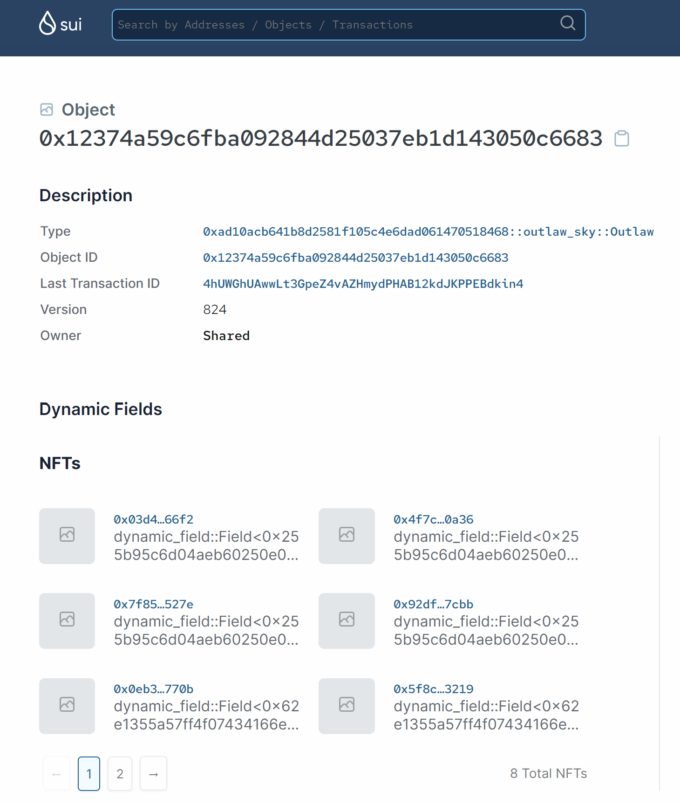

[Block Explorer Example](https://explorer.sui.io/object/0x12374a59c6fba092844d25037eb1d143050c6683)

Currently the Sui explorer displays all non-Coin objects as 'NFTs'. We should dispense with this fungible vs non-fungible token dichotomy inherited from Ethereum. In Sui Move, every struct is an object; how do we display them to users? This is an open greenfield UX problem; we'd love to see what the community comes up with!

For Capsules, we've built a universal standard that allows Metadata to be attached to any object with the `key` attribute as a dynamic field. This metadata should be displayed in block explorers as if they were static fields stored directly within the object struct itself. For example, display fields like this:

```
Metadata:
name: Kyrie
description: ninja girl from Outlaw Sky
image: <url>
power_level: 99
```

Don't display them like this:

```
{
  "type": "0x62e1355a57ff4f07434166e519e5e71e13e9d999::metadata::Key",
  "fields": {
    "slot": "image"
  }
}
```

Additionally, for certain objects (such as Capsules) the Ownership module attaches its own fields as well, listing the owner, creator, and transfer authorities--all of which are very important!

Additionally, the struct-type of the object and the creator of the package that defined the object may have metadata associated with it as well; all of this can be useful info to display.
